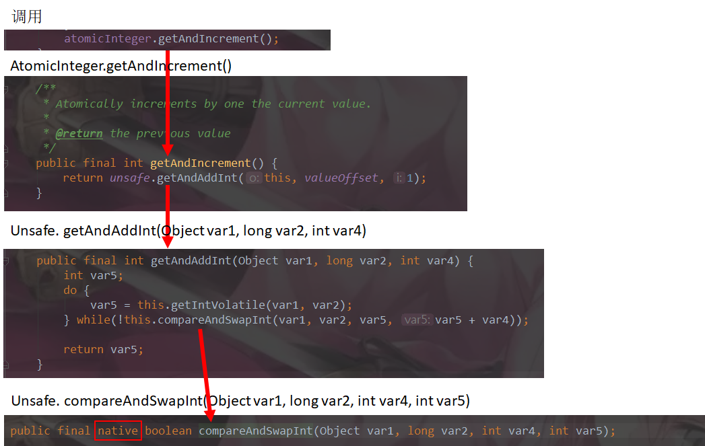

## 1.CAS是什么
### [1].在AtomicInteger中的compareAndSet方法是这么定义的，即CAS就是Compare-And-Swap（比较并交换）的缩写，另外CAS还有Central Authentication Service（统一认证服务/单点登录）等众多的含义，这里讨论的只是Compare-And-Swap这种含义
```java
/**
* Atomically sets the value to the given updated value
* if the current value {@code ==} the expected value.
*
* @param expect the expected value
* @param update the new value
* @return {@code true} if successful. False return indicates that
* the actual value was not equal to the expected value.
*/
public final boolean compareAndSet(int expect, int update) {
    return unsafe.compareAndSwapInt(this, valueOffset, expect, update);
}
```
### [2].CAS是乐观锁的一种实现
### [3].是一条CPU的原子指令，其作用是让CPU先进行比较两个值是否相等，然后原子地更新某个位置的值，其实现方式是基于硬件平台的汇编指令,CAS并发原语体现在JAVA语言中就是sun.misc.Unsafe类中的各个方法。调用UnSafe类中的CAS方法，JVM会帮我们实现出CAS汇编指令。这是一种完全依赖于硬件的功能，他通过实现了原子操作。再次强调，由于CAS是一种系统原语，原语属于操作系统用语范畴，<span style="color:red"> 是由若干条指令组成的，用于完成某个功能的一个过程并且原语的执行必须是连续的，在执行过程中不允许被终端，也就是说CAS是一条CPU的原子指令，不会造成所谓的数据不一致 </span>
## 2.CAS底层原理
### [1].源码
#### ①.AtomicInteger.getAndIncrement()方法
```java
/**
* Atomically increments by one the current value.
*
* @return the previous value
*/
public final int getAndIncrement() {
    return unsafe.getAndAddInt(this, valueOffset, 1);
}
```
#### ②.unsafe和valueOffset的定义
```java
public class AtomicInteger extends Number implements java.io.Serializable {
    private static final long serialVersionUID = 6214790243416807050L;

    // setup to use Unsafe.compareAndSwapInt for updates
    private static final Unsafe unsafe = Unsafe.getUnsafe();
    private static final long valueOffset;

    static {
        try {
            valueOffset = unsafe.objectFieldOffset
                (AtomicInteger.class.getDeclaredField("value"));
        } catch (Exception ex) { throw new Error(ex); }
    }

    private volatile int value;
```
### [3].分析
#### ①.Unsafe，是CAS的核心类，由于Java方法无法直接访问底层系统，需要通过本地（native）方法来访问，Unsafe相当于一个后门，基于该类可以直接操作特定内存的数据，其方法可以像C的指针一样操作内存，所有的方法都是native修饰的，也就是直接调用操作系统资源执行。unsafe是Unsafe类的一个实例， Unsafe的具体路径为rt.jar/sun/misc/Unsafe.class
#### ②.变量valueOffset，表示该变量值在内存中的偏移地址，因为Unsafe就是根据内存偏移地址获取数据的。
#### ③.变量value用volatile修饰，保证了多线程之间的内存可见性。
### [4].调用原理

### [5].Unsafe类中的compareAndSwapInt，是一个本地方法，该方法的实现位于unsafe.cpp中，红色部分即保证其原子性