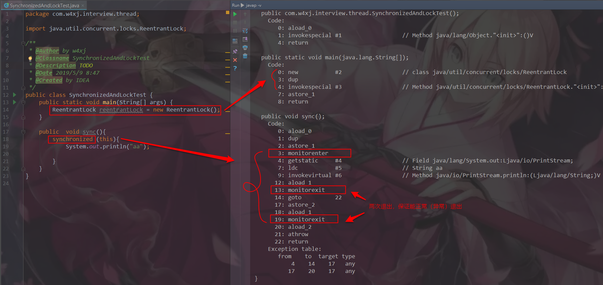

## 1.公平锁与非公平锁
### [1].公平锁
    是指多个线程按照申请锁的顺序来获取锁，类似排队
### [2].非公平锁
    是指多个线程获取锁的顺序并不是按照申请锁的顺序，有可能后申请的线程比先申请的线程优先获得锁，在高并发情况下，有可能会造成优先级反转或者饥饿现象
### [3].两者的区别并发包中ReentrantLock的创建可以指定构造函数的boolean类型来得到公平锁或非公平锁，默认即非公平锁
```java
/**
* Creates an instance of {@code ReentrantLock}.
* This is equivalent to using {@code ReentrantLock(false)}.
*/
public ReentrantLock() {
    sync = new NonfairSync();
}

/**
* Creates an instance of {@code ReentrantLock} with the
* given fairness policy.
*
* @param fair {@code true} if this lock should use a fair ordering policy
*/
public ReentrantLock(boolean fair) {
    sync = fair ? new FairSync() : new NonfairSync();
}
```
#### ①.公平锁：   
    Threads acquire a fair lock in the order in which they requested it
    公平锁，就是很公平，在并发环境中，每个线程在获取锁时会先查看此锁维护的等待队列，如果为空，或者当前线程是等待队列的第一个，就占有锁， 否则就会加入到等待队列中，以后会按照FIFO的规则从队列中取到自己
```java
java.util.concurrent.locks.ReentrantLock$FairSync.java


protected final boolean tryAcquire( int acquires) {
     final Thread current = Thread.currentThread();
     int c = getState();
     //状态为0，说明当前没有线程占有锁
     if (c ==  0 ) {
        //如果当前线程是等待队列的第一个或者等待队列为空，则通过cas指令设置state为1，当前线程获得锁
         if (isFirst(current) &&
             compareAndSetState( 0 , acquires)) {
             setExclusiveOwnerThread(current);
             return true ;
         }
     }
//如果当前线程本身就持有锁，那么叠加状态值，持续获得锁
     else if (current == getExclusiveOwnerThread()) {
         int nextc = c + acquires;
         if (nextc <  0 )
             throw new Error( "Maximum lock count exceeded" );
         setState(nextc);
         return true ;
      }
      //以上条件都不满足，那么线程进入等待队列。
      return false ;
}
```
#### ②.非公平锁：
    a nonfair lock permits barging: threads requesting a lock can jump ahead of the queue of waiting threads if the lock happens to be available when it is requested.
    非公平锁比较粗鲁，上来就直接尝试占有锁，如果尝试失败，就再采用类似公平锁那种方式
```java
java.util.concurrent.locks.ReentrantLock$Sync.java


final boolean nonfairTryAcquire(int acquires) {
    final Thread current = Thread.currentThread();
    int c = getState();
    if (c == 0) {
        //如果当前没有线程占有锁，当前线程直接通过cas指令占有锁，管他等待队列，就算自己排在队尾也是这样
        if (compareAndSetState(0, acquires)) {
            setExclusiveOwnerThread(current);
            return true;
        }
    }
     else if (current == getExclusiveOwnerThread()) {
        int nextc = c + acquires;
        if (nextc < 0) // overflow
            throw new Error("Maximum lock count exceeded");
        setState(nextc);
        return true;
    }
    return false;
}
```
### [4].非公平锁比公平锁吞吐量大
### [5].synchronized也是一种非公平锁
## 2.可重入锁
### [1].重入锁（ReentrantLock）是一种递归无阻塞的同步机制。重入锁，也叫做递归锁，指的是同一线程 外层函数获得锁之后 ，内层递归函数仍然有获取该锁的代码，在同一个线程外层方法获取锁的时候，在进入内层方法会自动获得锁，也就是说，线程可以进入它任何一个它已经拥有的锁锁同步着的代码块。
### [2].ReentrantLock和synchronized都是可重入锁。
##### [ReentrantLock可重入锁示例](./code/ReentrantLockTest1.java)
### [3].可重入锁最大的作用就是避免死锁
## 3.自旋锁
### [1].自旋锁，由于自旋锁使用者一般保持锁时间非常短，因此选择自旋而不是睡眠是非常必要的，自旋锁的效率远高于互斥锁。如何旋转呢？何为自旋锁，就是如果发现锁定了，不是睡眠等待，而是采用让当前线程不停地的在循环体内执行实现的，当循环的条件被其他线程改变时 才能进入临界区。<span style="color:red">这样的好处是减少上下文切换的消耗，缺点是会消耗CPU。Unsafe类的getAndAddxxx就是典型的自旋锁</span>
```java
public final int getAndAddInt(Object var1, long var2, int var4) {
    int var5;
    do {
        var5 = this.getIntVolatile(var1, var2);
    } while(!this.compareAndSwapInt(var1, var2, var5, var5 + var4));
    return var5;
}
```
### [2].手写自旋锁
#### [自旋锁实现](./code/SpinLock.java)
### 4.独占锁（写锁）、共享锁（读锁）与互斥锁
#### [1].独占锁：指该锁一次只能被一个线程所持有。对ReentrantLock和Synchronized而言都是独占锁
#### [2].共享锁：指该锁可以被多个线程所持有。对ReentrantReadWriteLock其读锁是共享锁，其写锁是独占锁。
#### [3].读锁的共享锁可以保证并发是非常高效的，读写、写读、写写的过程都是互斥的
#### [4].ReentrantReadWriteLock代码案例，加锁和不加锁的对比
[ReentrantReadWriteLock读写锁效果](./code/ReentrantReadWriteLockTest1.java)
## 5.补充：synchronized和Lock的区别
### [1].原始构成
#### ①.synchronized是关键字属于JVM层面，monitorenter/monitorexit(底层是通过monitor对象来完成，其实wait/notify等方法也依赖monitor对象只有在同步代码块和同步方法中才能调用wait/notify等方法)
#### ②.Lock是具体的类，是api层面的锁；

### [2].使用方法
    synchronized不需要用户手动释放锁，synchronized代码执行完成以后系统会自动让线程释放对锁的占有
    ReentrantLock则需要用户手动去释放锁，若没有主动释放锁，就有可能导致死锁现象。需要使用lock()和unlock()方法配合try finally语句块来完成。
### [3].等待是否可以中断
#### ①.synchronized不可中断，除非抛出异常或者正常运行完成。
#### ②.ReentrantLock可中断，
##### a.设置超时方法tryLock(long timeout, TimeUnit unit);
##### b.lockInterruptibly()放入代码块中，调用interrupt()方法可中断；
### [4].加锁是否公平
#### ①.synchronized是非公平锁
#### ②.ReentrantLock默认是非公平锁，可设置为公平锁。
### [5].锁绑定多个条件condition
#### ①.synchronized没有；
#### ②.ReentrantLock用来实现分组唤醒需要唤醒的线程们，可以精确唤醒，而不是像synchronized要么随机唤醒一个，要么唤醒全部线程。
[ReentrantLock多条件精确唤醒代码示例](./code/MultipleCondition.java)
### [6].性能：两者的性能已经相差无几
    在JDK1.6之前，synchronized 的性能是比 ReenTrantLock 差很多。具体表示为：synchronized 关键字吞吐量岁线程数的增加，下降得非常严重。而ReenTrantLock 基本保持一个比较稳定的水平。我觉得这也侧面反映了， synchronized 关键字还有非常大的优化余地。后续的技术发展也证明了这一点，我们上面也讲了在 JDK1.6 之后 JVM 团队对 synchronized 关键字做了很多优化。JDK1.6 之后，synchronized 和 ReenTrantLock 的性能基本是持平了。所以网上那些说因为性能才选择 ReenTrantLock 的文章都是错的！JDK1.6之后，性能已经不是选择synchronized和ReenTrantLock的影响因素了！而且虚拟机在未来的性能改进中会更偏向于原生的synchronized，所以还是提倡在synchronized能满足你的需求的情况下，优先考虑使用synchronized关键字来进行同步！优化后的synchronized和ReenTrantLock一样，在很多地方都是用到了CAS操作。

